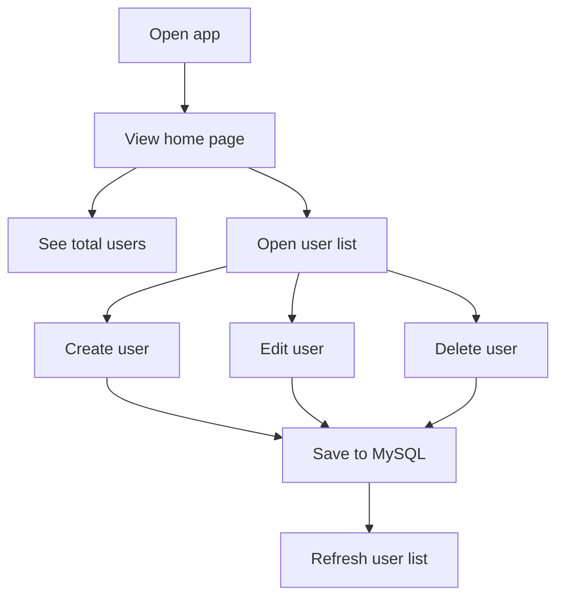

<p align="center">
  
</p>

<h1 align="center">user-listing-app</h1>

<p align="center"><i>A lightweight Node.js and Express app for managing users with a MySQL database.</i></p>

<p align="center">
  
  
  
  
</p>

## Table of Contents

- [🚀 Project intro](#-project-intro)
- [📁 Project structure](#-project-structure)
- [🔧 Features](#-features)
- [🧰 Tech stack](#-tech-stack)
- [⚙️ Install methods](#-install-methods)
- [🗄️ Database structure](#️-database-structure)
- [📜 Available scripts](#-available-scripts)
- [🤝 Contributing](#-contributing)
- [📄 License](#-license)

## 🚀 Project intro

This project is a lightweight user management app built with Express and EJS. It connects to a MySQL database and supports the following actions:

- View the total number of users on the home page
- Display all users in a table
- Create a new user using a form
- Edit an existing username after password verification
- Delete a user after password verification

## 📁 Project structure

```txt
user-listing-app/
├── index.js
├── package.json
├── scema.sql
└── views/
    ├── delete.ejs
    ├── edit.ejs
    ├── form.ejs
    ├── home.ejs
    └── showUser.ejs
```

## 🔧 Features

| Feature | Status | Description |
| --- | :---: | --- |
| Home overview | ✅ Current | Displays the total number of users on the landing page. |
| User listing | ✅ Current | Shows all stored users in a clear table view. |
| Create user | ✅ Current | Provides a form to add a new user to the database. |
| Edit user | ✅ Current | Allows updating an existing username after password verification. |
| Delete user | ✅ Current | Supports secure removal of a user after password verification. |
| Unique IDs | ✅ Current | Assigns each new user a UUID for identification. |

### Workflow



## 🧰 Tech stack

- **Runtime:** Node.js
- **Framework:** Express.js
- **Templates:** EJS
- **Database client:** MySQL2
- **Request override:** method-override
- **Unique IDs:** uuid
- **Seed/demo data:** @faker-js/faker
- **Development helper:** nodemon

## ⚙️ Install methods

### Prerequisites

- Node.js installed on your machine
- A running MySQL server

### Steps

1. Clone the repository and move into the project folder.
2. Install dependencies:

```bash
npm install
```

3. Create the database and table. The SQL script is available in [scema.sql](scema.sql).

4. Update the MySQL connection settings in [index.js](index.js) if your local credentials differ.

The current code uses:

- Host: localhost
- User: root
- Database: delta
- Password: 12345

5. Start the server:

```bash
node index.js
```

Or with nodemon:

```bash
npx nodemon index.js
```

6. Open the app in your browser at:

```txt
http://localhost:8080
```

## 🗄️ Database structure

The application uses a single table named `user`.

### Table: `user`

| Column | Type | Notes |
| --- | --- | --- |
| id | VARCHAR(50) | Primary key |
| username | VARCHAR(50) | Unique |
| email | VARCHAR(50) | Unique and required |
| password | VARCHAR(50) | Required |

The SQL schema is defined in [scema.sql](scema.sql).

## 📜 Available scripts

The current package configuration includes:

```bash
npm test
```

This script is still a placeholder and does not run any real tests yet.

## 🚀 Main routes

The app exposes the following routes:

- `GET /` - Home page with total user count
- `GET /user` - Show all users
- `GET /user/form` - Show the create user form
- `POST /user/form` - Create a user
- `GET /user/:id/edit` - Show the edit form
- `PATCH /user/:id` - Update a username
- `GET /user/:id/delete` - Show the delete confirmation form
- `DELETE /user/:id` - Delete a user

## 🤝 Contributing

Contributions are welcome. If you want to improve the app, you can:

- Fork the repository
- Create a feature branch
- Make your changes locally
- Test the CRUD flow in the browser

## 📄 License

This project is licensed under the ISC License.
